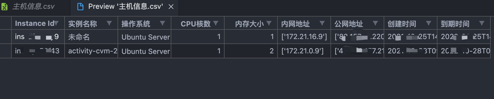

# Tencent_Yun_tools

* 使用 python3.9 + 腾讯云 AccessKey 利用工具
* 使用之前请先填写config.ini配置文件

## >  Usage

```python
python3 Tencent_rce.py -h
```

 

## >  Scanner

```python
python3 Tencent_rce.py -s
```
 

* 生成CSV文件
 

## >  Runcommand

```python
python3 Tencent_rce.py -i ins-xxxxx -r ap-beijing -c "touch /tmp/12.txt"
```

 
 
 ----
 
 
 * 需要注意的点：-r 参数后边 + 地域信息后边不要加数字 例如北京，就直接ap-beijing 香港：ap-hongkong
 
 * 本项目仅供测试使用 ～
